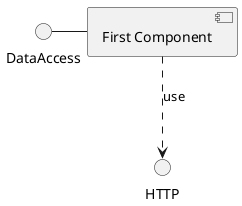

背景

软件系统产生于对实际生活生产过程的电子化模拟。类比管家的概念：根据指示周期性或一次性的完成一些标准化的重复性的工作。其特点在于：能周期性的自主完成工作；也可以不定期的接收指示并完成工作；工作内容流程标准化且具有重复性特点；对工作执行的结果会进行记录和反馈。

系统功能描述

从不同渠道（如微信公众号一类的服务、钉钉一类的办公软件、服务直接提供的接口等）接收消息，根据消息中的指示查找相应的工作配置，进行权限和参数的验证；对验证成功的工作进行正式执行；并最终将工作执行结果（成功/失败及具体的结果）由相同渠道返回。

模块划分

消息管理、指示管理和工作管理三个模块。消息模块负责消息的接收和回复、指示的转换、以及回话的管理；指示模块负责查找相应的工作配置，并进行权限和参数的验证；工作模块包含工作步骤的配置和实际执行。

工作模块

背景介绍

该部分即阐述【为什么要独立出工作模块】。

根据之前的描述，工作模块中最重要的概念就是工作（Work）和步骤（Step）。甚至整个系统中最重要的就是工作和步骤，所有的指示、配置和参数等，都是为了最终执行步骤明确的工作；与用户的交互，也是基于有工作需要被执行和有工作已经执行结束。

因此工作模块作为整个系统的核心，同时也是系统中最复杂的部分。

由于工作具有流程标准化的特点，因此每项工作都可以被详细的描述为一系列不同类型的步骤（如rest访问、MySQL查询、MongoDB查询、Redis查询、shell命令执行等）；但又由于工作内容的多样性，以及不同类型步骤在细节上的操作不同，因此可能会出现很多不同细分类型的步骤。同时，步骤中可能用到的各种url等参数，也需要以适当的方式进行管理。

场景描述

常见工作通常可以归类为：周期性完成某项工作（如日志填写情况检查）；通过简单的接口调用或数据库查询一些信息（如在Saas化服务下查询某个产品对应的租户信息甚至业务数据）；通过一系列接口调用、数据库查询和逻辑判断完成简单的日常运维问题原因排查（如用户是否由于权限不足而看不到某条数据）；通过一系列接口调用、服务器操作完成简单的运维问题处理（如数据库主从切换）等。

方案概述

该服务将尽量以领域驱动设计（DDD）的方式进行设计与开发。

每个工作可以包含多个步骤。显然工作和步骤应该作为一个限界上下文；每个步骤在执行时又需要使用一些资源（如数据库连接信息），因此资源配置作为一个底层模块为其提供数据。

用例描述

系统模块

类图结构

时序描述

配置示例